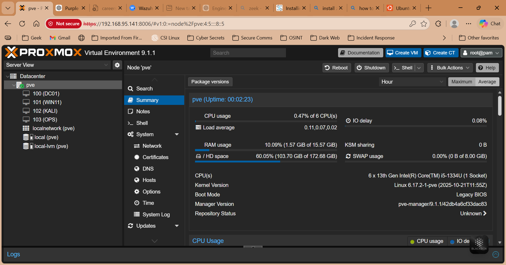
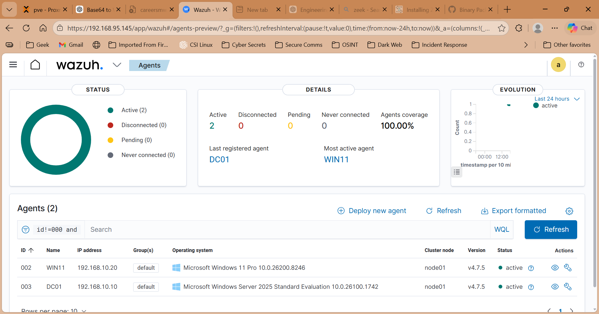
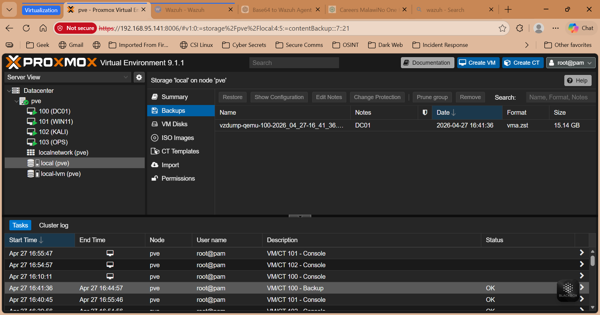

# Systems Administration Lab

## Project Overview

This project simulates a real-world enterprise IT environment aligned with Systems Administration responsibilities such as Active Directory management, DNS configuration, virtualization, monitoring, and backup/recovery.

## Architecture

The lab is built using Proxmox virtualization with the following components:

- **DC01 (Windows Server)** – Active Directory, DNS
- **WIN11 (Client)** – Domain-joined workstation
- **OPS (Ubuntu Server)** – Wazuh SIEM + Zeek monitoring
- **KALI (Linux)** – Attack simulation

See full design: [`docs/architecture.md`](docs/architecture.md)

---

## Key Implementations

### Active Directory

- User and group management
- Group policy enforcement
- Domain authentication

### DNS

- Forward lookup zone (`leolab.localS`)
- Client name resolution

### Monitoring (Wazuh)

- Endpoint log collection
- Failed login detection
- System activity monitoring

### Backup & Recovery

- VM-level backups using Proxmox
- Restore testing and validation

### Incident Simulation

- Brute-force login simulation
- Detection via logs and SIEM

---

## Evidence (Screenshots)

| Area     | Preview                                            |
| -------- | -------------------------------------------------- |
| Proxmox  |  |
| AD Users |                    |
| Wazuh    |     |
| Backup   |         |

---

## Skills Demonstrated

- Systems Administration (Windows/Linux)
- Virtualization (Proxmox)
- Identity Management (Active Directory)
- Network Services (DNS)
- Monitoring & Logging (Wazuh)
- Backup & Recovery
- Troubleshooting & Incident Analysis

---

## Incident Example

See: [`incidents/brute-force.md`](incidents/brute-force.md)

---

## Author

Leo Mathole
