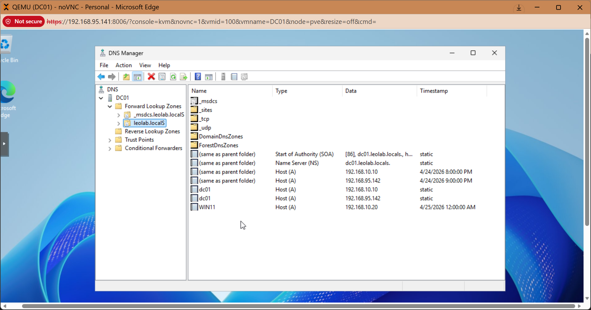
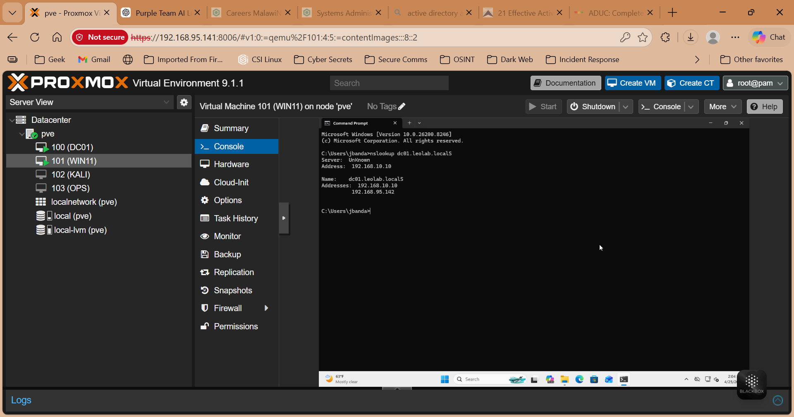

# DNS Configuration

## Objective

To enable name resolution within the domain environment.

## Server Details

- Server: DC01
- IP Address: 192.168.10.10
- Role: DNS Server

## Configuration Steps

1. Installed DNS Server role
2. Created Forward Lookup Zone:
   - Name: leolab.localS
3. Verified DNS records

## Client Configuration

WIN11 DNS configured to:

```
192.168.10.10
```

## Testing

### Command

```
nslookup dc01.leolab.localS
ping dc01
```

## Evidence

### DNS Zone



### Name Resolution



## Result

- Successful name resolution
- Stable communication between systems

## Conclusion

DNS is correctly configured and supports Active Directory operations.
