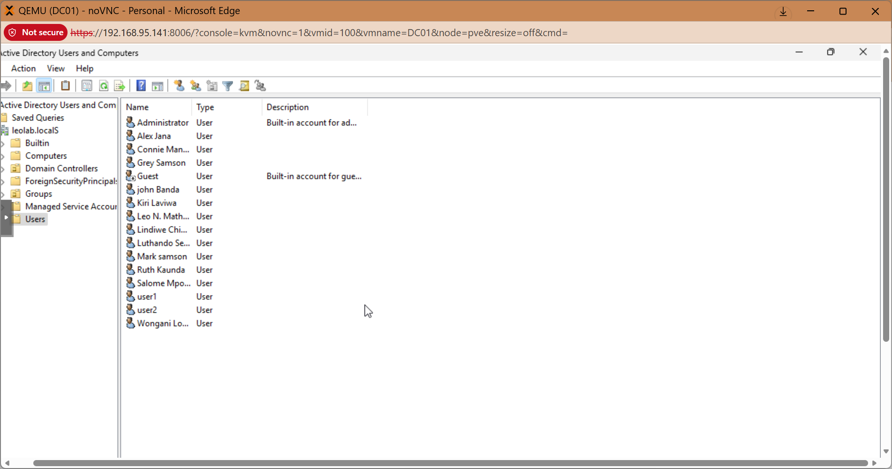
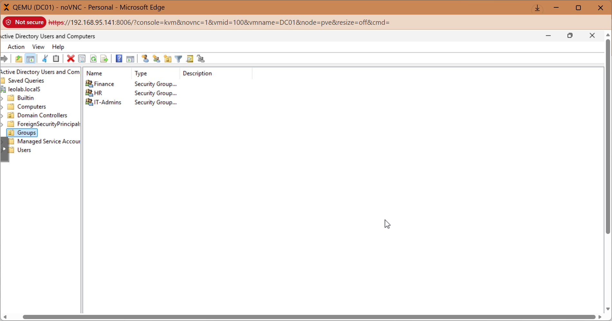
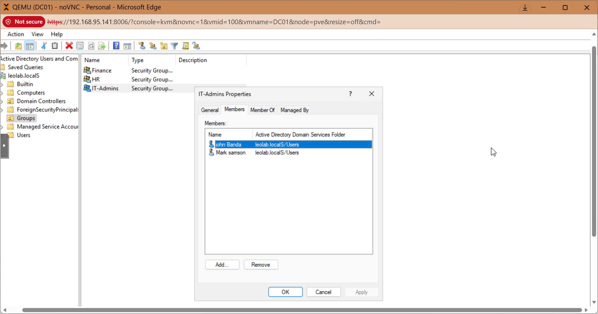
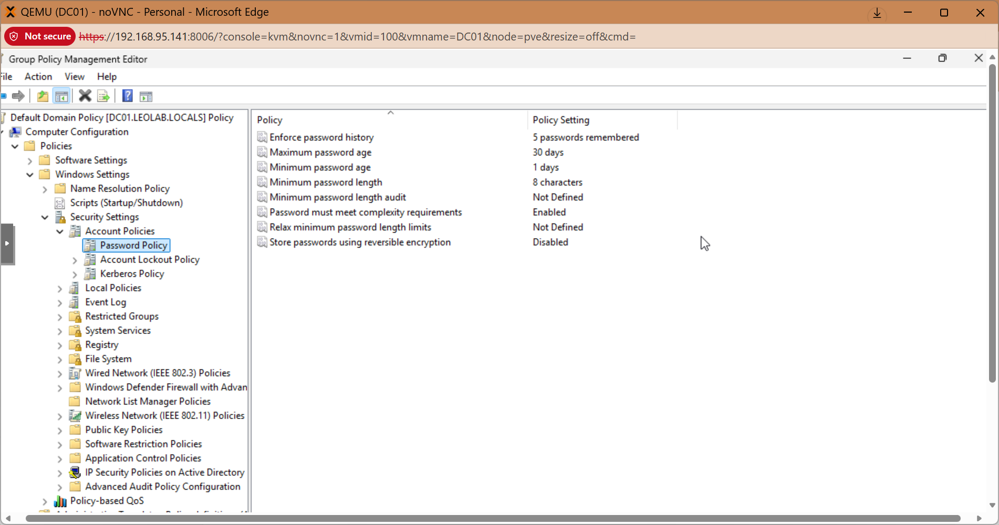

# Active Directory Users & Groups

## Objective

Create and manage domain users and security groups within Active Directory.

---

## Steps Performed

1. Opened **Active Directory Users and Computers (ADUC)**

2. Created Organizational Units (OUs):
   
   - IT
   - Finance
   - HR

3. Created Users:
   
   - Luthando Seunda
   - john Banda

4. Created Security Groups:
   
   - IT_Admins
   - Finance_Users
   - HR_users

5. Assigned users to groups

---

## Evidence

### 👥 Users Created

### 🧩 Groups Created

## Assigned users to groups

## Password Policy

---

## Result

- Users successfully created and managed
- Group-based access control implemented

---

## Real-World Relevance

- Identity & Access Management (IAM)
- Enterprise user provisioning
- Role-Based Access Control (RBAC)

---
