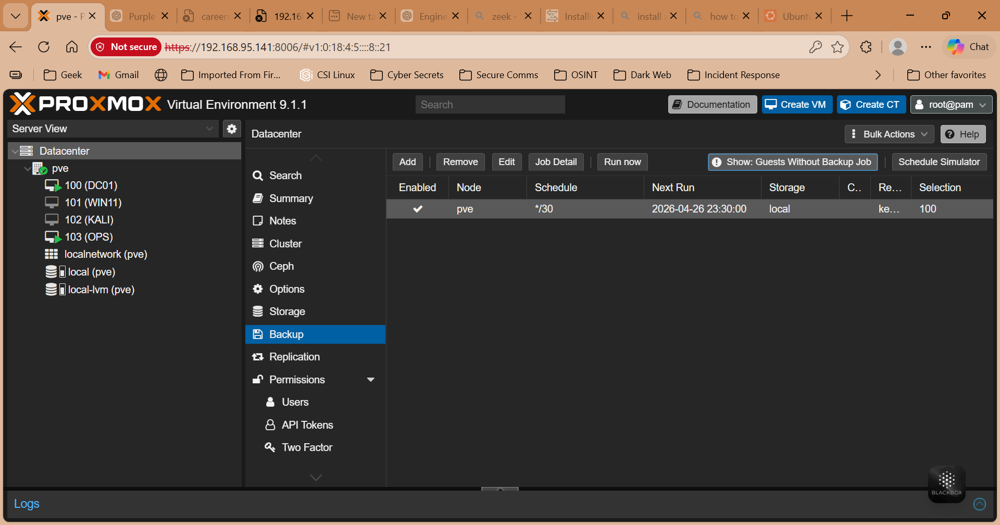
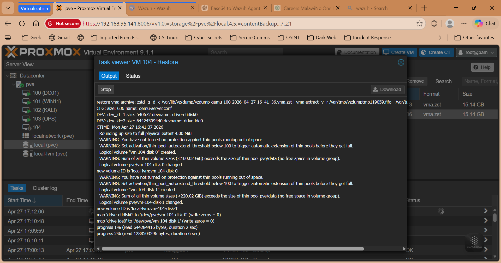

# Backup and Recovery Strategy

## Objective

Ensure system availability and data recovery in case of failure.

## Method

Using Proxmox built-in backup functionality.

## Configuration Steps

1. Navigate to Datacenter → Backup
2. Create a backup job
3. Select VMs:
   - DC01
   - WIN11
4. Set schedule (Daily)

## Backup Mode

- Snapshot mode used for consistency

---

## Testing Recovery

### Scenario

- Deleted a test user from Active Directory

### Action

- Restored VM from backup

---

## Evidence

### Backup Job

### Backup Success

### Restore Process

---

## Result

- System successfully restored  
- Data integrity maintained  

---

## Importance

Backups ensure:

- Business continuity  
- Disaster recovery readiness  

---

## Conclusion

Backup and restore procedures are functional and reliable.
