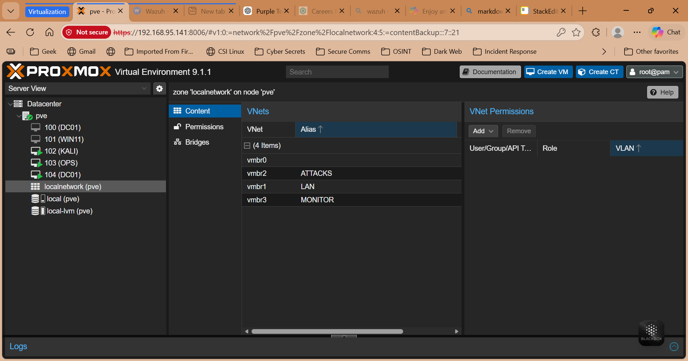

# Network Design

## Overview

The lab environment is designed as a virtual enterprise network using Proxmox.

## Network Type

- Virtual Bridge: vmbr0
- Internal Network Range: 192.168.100.0/24

## IP Addressing Scheme

| Machine | Role                    | IP Address     |
| ------- | ----------------------- | -------------- |
| DC01    | Domain Controller / DNS | 192.168.100.10 |
| WIN11   | Client Workstation      | 192.168.100.20 |
| OPS     | Monitoring Server       | 192.168.100.30 |
| KALI    | Attack Machine          | 192.168.100.40 |

## DNS Configuration

- Primary DNS Server: 192.168.100.10 (DC01)
- Domain: lab.local

## Connectivity Tests

### Ping Test

```
ping dc01
```

### DNS Resolution

```
nslookup dc01.lab.local
```

## Screenshot Evidence

### Network Overview



## Conclusion

The network supports domain communication, monitoring traffic, and simulating attacks within an isolated lab environment.
