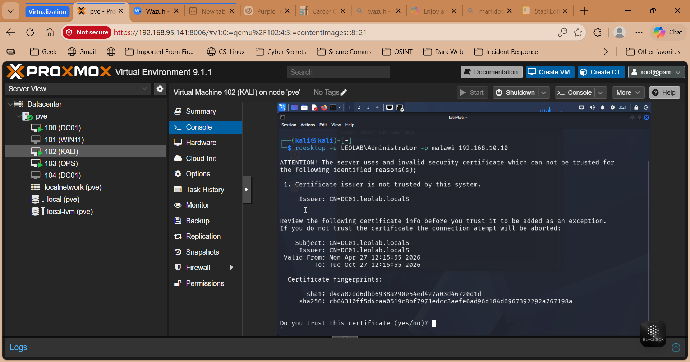

# 👨‍💻 Leo Mathole

**Systems Administrator | Active Directory | Monitoring | Virtualization**

---

## 🧠 What I Do

I design, deploy, and troubleshoot enterprise IT systems with a focus on:

- Identity & Access Management (Active Directory)
- Infrastructure Monitoring (Wazuh SIEM)
- Backup & Disaster Recovery
- System Performance & Reliability

---

## ⚡ Proven Capabilities

✔ Built and managed a domain environment (AD + DNS)  
✔ Deployed centralized monitoring and log analysis  
✔ Implemented backup and recovery strategy  
✔ Simulated and analyzed security incidents  
✔ Troubleshot real system failures under lab conditions  

## 📸 Live System Evidence

---

## 🖥️ Lab Architecture

---

## 🔑 Core Modules

### 🔐 Active Directory

Manage users, groups, and authentication policies.

👉 [Explore AD Setup](ad/users-groups.md)

---

### 🌐 DNS

Internal domain resolution across systems.

👉 [Explore DNS](ad/dns.md)

---

### 📊 Monitoring

Real-time system and security monitoring.

👉 [Explore Monitoring](monitoring/wazuh.md)

---

### 💾 Backup & Recovery

Reliable backup and restore strategy.

👉 [Explore Backup](backups/proxmox-backup.md)

---

### ⚠️ Incident Simulation

Brute-force attack detection and analysis.

👉 [Explore Incident](incidents/brute-force.md)

---

## 🛠️ Real Issues Solved

- Storage exhaustion in Proxmox  
- Wazuh agent communication failures  
- Domain authentication issues  
- Docker deployment challenges  

👉 [See Troubleshooting](docs/troubleshooting.md)

---

## 📂 Source Code

👉 https://github.com/leomathole/sysadmin-lab

---

## 📞 Contact

- Email: leomathole@gmail.com
- Phone: +265 888 881 406
